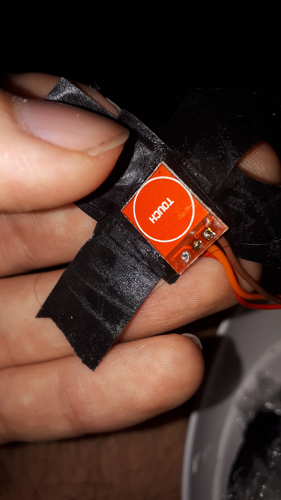

# Smart lamp with ESP8266
This is simple tutorial how to make smart lamp with ESP8266. Before you begin here you can look at video how the end result will look:

The lamp is controlled using two touch sensors and wifi (in hotspot mode).

## What will you need?
First of all you will need some lamp. It should be lamp powered by external power supply (the thing which you plug into power outlet, it is somewhat bigger that classical plug). Also there should be output voltage writen on the power supply or lamp. Anything from 9 to 24V is fine as those all are safe voltages for human touch so you can't hurt yourself.

Next you will need to buy few things:

- [ESP8266](https://www.aliexpress.com/item/32656775273.html) - NodeMCU
- [Step down convertor](https://www.aliexpress.com/item/33015256539.html)
- [Touch sensor](https://www.aliexpress.com/item/4000540638639.html)
- [Transistor](https://www.aliexpress.com/item/32878220199.html) - for example TIP120, but you can try some other

Also you will need some other things that you probably have lying around:

- (Electrical) tape + heat shrink tube
- Some wires
- Paper or some other stuff for filling space
- Micro USB cable
- Some resistor - value around 1kOhm should be fine, I used for example 2.2kOhm
- Multimeter

## Let's look at it

Here you can see schematic of whole lamp. Black and red wires from the plug are actually negative and positive wires from supply. Pink and violet wires are positive and negative wires leading LED lamp.

You also might like to keep original switch on lamp connected. To do this just place it in between powersupply and step down convertor (cutting the pink wire at left into two).

**IMPORTANT:** Also there is one thing which you need to do before even starting to solder everything together! You will need to configure proper voltage on step down convertor. This is done by connecting in to power supply (you can use the lamp or bench power supply) and changing value of potentiometer (small shiny thing - also the only one thing in which you can fit screwdriver and rotate with it) till you measure the voltage between `VO+` and `GND` to be about 5V.

I don't recommend to try using the voltage settings pads as they don't work properly.

## Programming setup

After you have everything ready you can start uploading code to your ESP8266. First you will need to download and install [Arduino IDE](https://www.arduino.cc/en/software). The project file can be found in folder `lamp_code`. Then open `File` -> `Preferences` and copy following URL `https://arduino.esp8266.com/stable/package_esp8266com_index.json` to `Additional board manager URL` field. Next open `Tools` -> `Development board` -> `ESP8266 baords` and choose `Generic ESP8266 module`. Now you just need to click arrow icon to start upload.

If you are getting error `serial.serialutil.SerialException: could not open port` then you need to `Tools` -> `Port` and choose some port.

You just might want to change this command `WiFi.softAP()` to one which will contain your new wifi name and password.

Now you will need to open your lamp and solder everything together according to schematics. After everything is soldered don't close up your lamp yet. Just turn it on and hope everything will work, if not then you will need to find bug or mistake.

## Lamp power

First you should check your lamp voltage. As said before it should be 9-24V. It is also possible to use 5V lamp, but you would need to left out step down convertor.

Here you can see the label on lamp - thing that matters is `9V DC`:

And here is power supply - thing that matters is again `9V`:

Also keep in mind that you should never try to open the power supply!

When you open up the lamp and don't have mutlimeter at hand, you can guess which cable is which based on their look.

Here you can see dashed line on single wire. This indicates that the dashed wire is negative (- sign).

Also inside of the lamp the most common color for positive wire is red. For negative it is blue and black.

## ESP8266 soldering

Here you can see how correctly soldered ESP8266 looks like:

But you might like to use included headers, so you can use detachable wires. This will give you the possibility to easily use ESP8266 for other projects, but it can make some connections slightly worse.

## Transistor soldering

Here is image how correctly soldered transistor looks like:

You can see that it's leg are wrapped in shirnk tube and also transistor itself is wraped in tape. This is because the metal back of transistor act as collector and if exposed to other circuits it can cause problems. But if you insulate all other circuits well, then you don't need to wrap the transistor in tape and insted mount it to piece of metal to act as cooler. But this is not really necassary as the transistor is also cool without cooling.

## Touch sensor

If everything worked just fine put touch sensor close to inside of lamp case. If it turns on by itself you will need to get some pieces of paper or other stuff and make big enough space so it doesn't turn on itself. Now turn on your lamp and try to touch lamp case from outside, if nothing happens then try to touch by your whole palm. If still nothing happens that means you created too big space from paper and you will need to remove some.

You should put tape in way so it doesn't cover touch pad - so you can stick the sensor to lamp. You can see example on image below:

Here you can see example of paper over touch sensor:

Now here they are taped to lamp:

After you are done you should put again some paper or something to cover the touch sensors. This will protect them from beign touched by wires which could induce false touches.

Here is example with bubble foil used:

Then you can wrap all components into tape which will protect them from shor circuits. After this you are done, so you can close your lamp and enjoy it!

## Credits
- [Gamma table generator](https://victornpb.github.io/gamma-table-generator/)
- [Range slider](https://www.w3schools.com/howto/howto_js_rangeslider.asp)